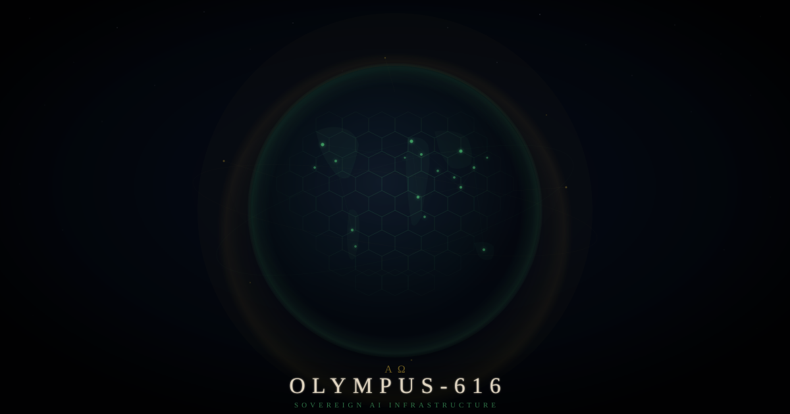

<p align="center">
  
</p>

<h1 align="center">ΑΩ</h1>

<h3 align="center">Olympus-616</h3>

<p align="center"><em>Sovereign AI Infrastructure</em></p>

---

<p align="center">
  Your hardware. Your models. Your data. Your grid.<br/>
  One command. Any device. Zero vendor lock-in.
</p>

---

## The Grid

Olympus-616 is a sovereign AI platform — a complete operating system for AI agents that runs on your terms.

One codebase deploys identically to a laptop, a Raspberry Pi, a private server, or a global cloud mesh. The system you run at home is the same system that scales to enterprise. No modifications. No dependencies. No permission required.

```
./olympus.sh
```

That's the whole deployment.

---

## Status

**31 services. 64 endpoints. Online.**

| Metric | |
|---|---|
| Fleet | 31 microservices, zero failures from fresh `git clone` |
| Coverage | 198 passing tests, 99% code coverage |
| Proxy Architecture | Ares → Hermes → God service routing |
| Mobile | TurtleShell.ai — iOS, streaming AI, Salesforce OAuth 2.0 PKCE |
| Cloud | AWS ECS/Fargate + CloudFront, proven local ↔ cloud parity |
| Enterprise | Salesforce MCP integration, multi-org architecture |

---

## Launch

<h3 align="center">July 17, 2026</h3>

<p align="center">
  Global deployment. Open source protocol release.<br/>
  Full specifications and documentation published on day one.
</p>

<p align="center">
  The architecture is designed to propagate independently of any single entity.<br/>
  Until then, the grid is in private beta.
</p>

---

## Entry Points

| | |
|---|---|
| [**turtleshell.ai**](https://turtleshell.ai) | Mobile app — your sovereign AI in your pocket |
| [**olympus-616.ai**](https://www.olympus-616.ai) | Learn, fork, deploy your own grid |
| [**olympus-grid.com**](https://www.olympus-grid.com) | Enterprise — connect your organization |
| [**AppExchange**](https://appexchange.salesforce.com/appxListingDetail?listingId=aadbbe80-2d4e-42bc-84bd-348ade18a00a&tab=e) | Salesforce connector |
| [**Investors**](https://investors.olympus-foundation.org/) | Investment package — Series 1 Redeemable Preferred Units |

---

## The Tithe

Seven percent of every dollar of gross revenue flows to the Olympus Foundation — irrevocable, encoded in the governing documents, senior to all distributions. The Foundation owns the Cosmos Logos protocol and is dedicated to the elimination of human suffering through technology.

The tithe is architecture, not charity.

---

## Open Source

The protocol specification, architecture documentation, and deployment tooling will be released as open source on launch day. Every service, every endpoint, every integration — documented and deployable.

If you're here, you're early.

---

<p align="center">
  <em>"The mythology is the documentation. The documentation is the API.<br/>The API is the architecture. The architecture runs on your hardware.<br/>You own everything."</em>
</p>

<p align="center">
  Built by <strong>#nobody</strong>
</p>

<p align="center">© 2026 CloudPremise LLC. All rights reserved.</p>
